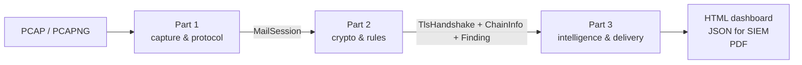

# 01 · Overview

## The problem

Email between machines still depends heavily on **opportunistic** encryption. When a mail
client or server connects on port 25, 587, 143 or 110, the conversation starts in **cleartext**.
The server lists what it supports, and if `STARTTLS` is in that list the client may ask to upgrade
the connection to TLS.

That design has a structural weakness. The negotiation that decides *whether* to encrypt happens
before any key material exists, so nothing protects it. An attacker on the path (a rogue Wi-Fi
access point, a compromised router, a malicious middlebox) can:

- **strip** the offer, for example by overwriting `STARTTLS` with `XXXXXXXX` in the server's
  capability list. The client thinks the server doesn't support TLS and carries on in cleartext,
  sending its password and mail.
- **inject** commands in cleartext around the upgrade, which buggy servers or clients then execute
  as if they came from inside the TLS session. Poddebniak et al. (USENIX Security 2021) found more
  than 40 vulnerable implementations.
- **downgrade** the TLS that is negotiated to an old protocol version or a weak cipher, or
  substitute their own certificate.

Even with no attacker present, real estates are full of weak configurations: TLS 1.0 servers,
3DES and RC4 suites, 1024-bit DH groups, expired or self-signed certificates, and legacy IMAP/POP3
services that accept passwords in cleartext.

## Why isn't this already solved?

The IETF has three standards in this area. All three **declare policy**; none of them
**measures what actually happened** on the wire.

| Standard | What it does | What it doesn't do |
|---|---|---|
| **MTA-STS** (RFC 8461) | A domain publishes "senders must use TLS with a valid cert" | Only helps senders that implement it; says nothing about client ↔ server traffic (587/143/110) |
| **DANE** (RFC 7672) | Pins the server's certificate in DNSSEC-signed TLSA records | Requires DNSSEC; again only relay-to-relay |
| **TLS-RPT** (RFC 8460) | Senders report aggregate TLS failures daily | Self-reported by remote senders, aggregated, delayed; never sees your own clients |

SPF, DKIM, DMARC and ARC authenticate the **message** (who sent it). They say nothing about whether
the **channel** it travelled over was encrypted.

**Implicit TLS** (RFC 8314: ports 465/993/995, TLS from the first byte) removes the strippable
negotiation, and the IETF now prefers it. But STARTTLS remains everywhere: on port 25 it is the
only option between mail servers.

So an organisation today has no easy way to answer "how is our mail *actually* being protected on
the wire, right now, and is anyone tampering with it?" SecureMailScope answers that from a packet
capture.

## What SecureMailScope does

1. **Part 1: capture and protocol.** Parse the capture, reassemble every TCP stream, identify
   SMTP/IMAP/POP3 **from the banner** (never from the port), and run a state machine that follows the
   STARTTLS upgrade. It notes where each direction switches to TLS, and flags stripping, injection
   and cleartext credentials.
2. **Part 2: cryptography and rules.** Parse the TLS handshake (version, cipher, key exchange,
   extensions, JA3/JA3S fingerprints), analyse the certificate chain, and apply deterministic rules
   that turn facts into findings. Each finding carries evidence, a config-level fix and a compliance
   mapping.
3. **Part 3: intelligence and delivery.** Build a feature vector per session. Compare each session
   with the **per-endpoint baseline**: what this server normally does. Score risk with a
   gradient-boosted model and explain the score. Flag statistical outliers with an isolation
   forest. Rank findings by risk × exposure × exploitability × asset criticality, compute a posture
   score, and write the reports.

The **three differentiators**:

| Differentiator | Where |
|---|---|
| STARTTLS stripping and injection detection | Part 1: `mailproto.py` |
| Plaintext credential detection (without storing the secret) | Part 1: `mailproto.py` |
| Per-endpoint anomaly baselining ("self-signed, Medium" becomes "possible active MITM, Critical") | Part 3: `baseline.py` |

## Passive, and why that matters

SecureMailScope never sends a packet. An active scanner (testssl.sh, SSLyze, SSL Labs) tells you
what a server *could* negotiate if you asked it; SecureMailScope tells you what your clients and
servers *did* negotiate. That's the only way to see stripping, injection, client-side
misconfiguration, or which users actually sent passwords in cleartext.

Passive analysis also avoids the **authorisation boundary**. Scanning systems you don't own, or
production systems during business hours, needs permission. Analysing a capture your SOC already
collected on your own network does not. That makes it deployable in places where scanning isn't.

## Privacy posture: metadata only

The tool must read passwords and message bodies to *recognise* them, but it keeps none of them:

- **Kept:** usernames (analysts need to know whose credentials to rotate), command verbs,
  capability names, byte counts, TLS parameters, certificate metadata.
- **Never stored:** passwords, OAuth tokens, SASL responses, message headers or bodies.
- Tests enforce this: `test_json_is_serialisable_and_privacy_preserving` checks that the demo
  passwords, raw or base64, do not appear in the JSON output.

## Limits

Everything that follows from being passive is reported as **unknown**, never as **fine**:

| Limit | Why | How it is reported |
|---|---|---|
| TLS 1.3 certificates | TLS 1.3 encrypts the Certificate message by design | `SMS-CERT-010` (info), "not observable"; the endpoint baseline from earlier TLS 1.2 sessions still applies |
| Revocation | Passive analysis cannot query CRL/OCSP | `revocation: unknown (passive analysis cannot check CRL/OCSP)` on every chain |
| IP fragments | Non-first fragments carry no TCP header | Counted in `fragments_skipped` in the report |
| Capture loss | Missing segments leave holes | Counted as `gaps`; the session is noted as possibly incomplete |
| Protocol of implicit-TLS sessions | Encrypted from byte one, so no banner | Inferred from the port and labelled "hint only" |
