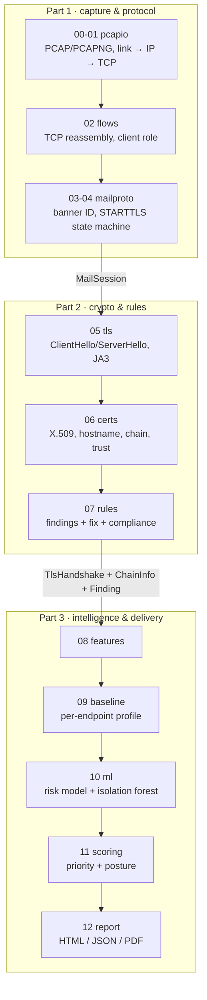

# 02 · Architecture

## The pipeline, stage by stage

| Stage | Module | Input | Output |
|---|---|---|---|
| 00–01 | `pcapio.py` | file path | `list[Packet]`, `ReadStats` |
| 02 | `flows.py` | packets | `list[Flow]`: two reassembled byte streams, client identified |
| 03–04 | `mailproto.py` | `Flow` | `MailSession`, or `None` if the flow isn't mail |
| 05 | `tls.py` + `ciphers.py` | the session's two TLS byte slices | `TlsHandshake` |
| 06 | `certs.py` | `TlsHandshake`, hostname, capture time | `ChainInfo` |
| 07 | `rules.py` | session, handshake, chain | `list[Finding]` |
| 08 | `features.py` | the above | feature dict (34 features) |
| 09 | `baseline.py` | observation + peers + SQLite history | deviation codes, new findings, escalations |
| 10 | `ml.py` | feature rows | model risk, group-Shapley explanation, anomaly score |
| 11 | `scoring.py` | all findings | priority risk per finding, ranked list, posture |
| 12 | `report.py` | `Analysis` | JSON, HTML, PDF |

`pipeline.analyze()` runs every stage in order and records how long each took. For the 687-frame
demo capture the parsing and rules stages together take about 0.1 s. The ML stage dominates:
about 1 s warm, plus scikit-learn's import time on a cold start.

## The handoff contracts

The PDF's advice was to agree the two handoff contracts on day one and freeze the field names, so all
three parts can proceed in parallel. They live in [`models.py`](../securemailscope/models.py).

### Part 1 → Part 2: `MailSession`

| Field | Meaning |
|---|---|
| `session_id`, `client`, `server` | identity; `client` is whoever sent SYN without ACK |
| `protocol` | `SMTP` / `IMAP` / `POP3`, from the **banner** |
| `mode` | `plaintext` / `starttls` / `implicit` |
| `banner`, `server_name` | greeting line and the hostname parsed from it |
| `capabilities`, `starttls_offered` | EHLO / CAPABILITY / CAPA list; whether the upgrade was offered |
| `starttls_requested`, `starttls_response`, `starttls_accepted` | what the client asked for and what the server said |
| `tls_client_offset`, `tls_server_offset` | **where each direction switches to TLS** (they differ) |
| `tls_client_bytes`, `tls_server_bytes` | the two TLS byte streams, sliced out for Part 2 |
| `auth_events` | `AuthEvent(mechanism, username, secret_exposed, accepted)`; the secret itself is never stored |
| `cleartext_commands`, `cleartext_message_bytes` | verbs only, and the byte count of bodies sent outside TLS |
| `strip_indicators`, `injection_indicators` | human-readable evidence strings |
| `stream_quality` | retransmissions, reordering, overlaps, conflicts, gaps |

### Part 2 → Part 3: `TlsHandshake`, `ChainInfo`, `Finding`

`TlsHandshake` holds the negotiated `version` (from extension 43 when present), `cipher_suite`,
the client's offered ciphers, extensions and groups (GREASE removed), `ja3`/`ja3s`, `dh_bits`,
`downgrade_sentinel`, `fallback_scsv`, alerts, and the DER certificates when they're visible.

`ChainInfo` holds per-certificate `CertInfo` (subject, issuer, key, signature hash, SANs, validity,
SHA-256 fingerprint), plus verdicts: `hostname_match`, `expired`, `self_signed`, `chain_links_ok`,
`trusted` and `revocation` (always "unknown").

`Finding` is the unit everything downstream works with:

| Field | Filled by |
|---|---|
| `rule_id`, `title`, `severity`, `category` | Part 2 (rules) or Part 3 (baseline, ML) |
| `evidence`, `remediation`, `compliance`, `references` | rules |
| `exploitability`, `confidence` | rules |
| `risk`, `priority` | Part 3 scoring |
| `escalated_from` | Part 3 baseline, when it raises the severity |

`SessionResult` bundles everything known about one session after all three parts.

## Dividing the work: three parts, narrow interfaces

| Part | Owns | Works against, until upstream is ready |
|---|---|---|
| 1 · Capture and protocol | `pcapio`, `flows`, `mailproto` | nothing upstream: starts first. Its test input is `samples.py` output or a lab capture |
| 2 · Crypto and rules | `tls`, `ciphers`, `certs`, `rules` | hand-built handshake bytes (`samples.client_hello()` etc.) and generated certificates; see `tests/test_tls.py`, which never touches a PCAP |
| 3 · Intelligence and delivery | `features`, `baseline`, `ml`, `scoring`, `report` | synthetic `MailSession`/`TlsHandshake`/`ChainInfo` objects; `ml.synthesize()` already makes thousands of them |

The test suite mirrors this split: `test_pcapio.py`, `test_flows.py` and `test_mailproto.py` for
Part 1; `test_tls.py` and `test_certs.py` for Part 2; `test_pipeline.py` for Part 3 and end-to-end.
`test_mailproto.py` builds `Flow` objects directly from byte strings, so the protocol layer can be
tested without any capture file.

## Design decisions

| Decision | Why |
|---|---|
| Hand-rolled `struct` parsing, no Scapy/pyshark | Zero native dependencies; runs on an air-gapped forensic box. Fast enough: the parsing stages take about 0.03 s for the demo capture. Full control over reassembly edge cases |
| Protocol from banner, never port | Shadow infrastructure on odd ports is exactly what we hunt (`SMS-PORT-001`) |
| Two TLS offsets per session | Each direction switches to TLS at a different byte offset. Tracking one offset silently produced "TLS present, version unknown" in the original prototype |
| Certificates judged at **capture** time | An analyst replaying an old capture needs to know whether the cert was valid *then* |
| Endpoint key = server IP:port, not hostname | An attacker in the path controls the banner hostname |
| Only clean sessions are learned into the baseline | Otherwise an attack poisons the profile it should be compared against |
| Flask for the UI | The shortest path. A FastAPI port is mechanical: `server.py` is about 100 lines with no business logic |
| SQLite for the baseline | Plenty for single-analyst use; swap for PostgreSQL only if you need multi-user |
| Self-contained HTML, inline SVG, no build step | Opens offline, can be emailed or archived as evidence, nothing to break during a demo |
