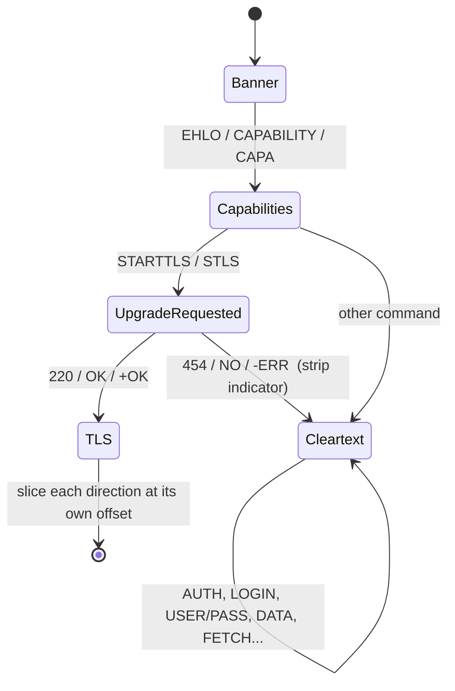

# 04 · Mail protocols and the STARTTLS state machine (stages 03–04)

This is where two of the three differentiators live: **stripping and injection detection**, and
**plaintext credential detection**.

Code: [`mailproto.py`](../securemailscope/mailproto.py) · Tests: [`test_mailproto.py`](../tests/test_mailproto.py)

## 1. Identify the protocol from the banner, never the port

The server speaks first in all three protocols, so its first bytes identify it:

| First server bytes | Protocol |
|---|---|
| `220 ` / `220-` (or `421`, `554`) | SMTP |
| `* OK`, `* PREAUTH`, `* BYE` | IMAP |
| `+OK`, `-ERR` | POP3 |
| a TLS record header (`16 03 ..`) from either side | **implicit TLS**; the protocol is inferred from the port (465/993/995) and labelled a *hint* |

A banner-identified service on a non-standard port gets a note and `SMS-PORT-001`. A printer's SMTP
relay on 2525 or an IMAP service someone forgot on 10143 is exactly the shadow infrastructure that
sits outside the TLS policy. TLS flows on non-mail ports (443) are ignored.

## 2. The three dialogues

**SMTP** (RFC 5321, RFC 3207, RFC 4954). Relay is port 25 (server to server, opportunistic TLS).
Submission is 587 (STARTTLS) or 465 (implicit TLS).

```
S: 220 mx.example.com ESMTP Postfix
C: EHLO client.example.org
S: 250-mx.example.com
S: 250-PIPELINING
S: 250-STARTTLS              ← the offer. Multi-line: "250-" continues, "250 " ends
S: 250 8BITMIME
C: STARTTLS
S: 220 2.0.0 Ready to start TLS
   ── TLS from here, at a different byte offset in each direction ──
```

**IMAP4rev1** (RFC 3501). Commands are tagged, and the reply to `a001` ends with a line starting `a001`:

```
S: * OK [CAPABILITY IMAP4rev1 STARTTLS LOGINDISABLED] Dovecot ready.
C: a001 STARTTLS
S: a001 OK Begin TLS negotiation now.
```

**POP3** (RFC 1939, RFC 2595). Single-line `+OK`/`-ERR` replies, except multi-line ones (CAPA,
LIST, RETR, TOP) that end with a line containing only `.`:

```
S: +OK pop.example.com ready
C: CAPA
S: +OK
S: USER
S: STLS                      ← POP3 calls it STLS
S: .
C: STLS
S: +OK Begin TLS negotiation
```

## 3. The state machine



The parser pairs client commands with server replies **in order** (lockstep), which also handles
SMTP pipelining because replies always come back in command order. Details that matter:

- **Multi-line replies**: SMTP `250-`…`250 `, IMAP untagged `*` lines until the tagged one, POP3 `.`.
- **SMTP `DATA`**: after `354`, the body runs to `\r\n.\r\n` and is **skipped and counted**, never
  parsed. A body line saying "EHLO" or "STARTTLS" must not be read as a command (`test_smtp_data_body_not_parsed_as_commands`).
- **SMTP `BDAT n`**: the next *n* bytes are body, and the reply comes after them.
- **IMAP literals** `{n}`: the client sends a length and, for synchronising literals, waits for a `+`
  continuation before sending *n* raw bytes. A password can arrive this way:
  `a2 LOGIN rahul {11}` → `+ go ahead` → `Winter2025!`. Server `FETCH` bodies arrive as literals too,
  and are counted as cleartext message bytes.
- **SASL continuations**: `334` (SMTP) or `+` (IMAP/POP3) challenge lines alternate with base64 client responses.

### Two offsets, not one

When the upgrade is accepted, the **client** starts TLS right after its `STARTTLS\r\n`, and the
**server** right after its `220 Ready…\r\n`. Those are different byte offsets in two different
streams. The session stores both (`tls_client_offset`, `tls_server_offset`) and slices each stream
separately. With a single offset, Part 2 gets a ServerHello with a dozen stray bytes in front of it
and reports "TLS present, version unknown" for every STARTTLS session. That's exactly what happened
in the first prototype.

## 4. Why STARTTLS is strippable, and TLS isn't

TLS protects its own negotiation. Both sides hash every handshake message into a **transcript**, and
the `Finished` messages carry a MAC over that transcript under the new keys. If an attacker changed
a single byte of the ClientHello, the Finished check fails and the connection dies. TLS negotiation
is **tamper-evident**.

The STARTTLS offer is outside that transcript. It is sent before any key exists, so nothing
authenticates it. Rewrite `250-STARTTLS` to `250-XXXXXXXX` and neither side can tell. The client
concludes the server doesn't do TLS, and (if configured "STARTTLS if available") carries on in
cleartext. This is why RFC 8314 now prefers implicit TLS.

## 5. Stripping detection

A session gets `strip_indicators` (then `SMS-STRIP-001`, critical) when any of these holds:

| Signal | Example | Why it indicates stripping |
|---|---|---|
| **Same-length rewrite** of the capability | `250-XXXXXXXX`, `STARTTLX`, `XTARTTLS`, POP3 `XXXX` | Middleboxes overwrite in place so TCP sequence numbers don't need fixing. `_looks_mangled()` flags tokens of exactly the target's length that are one repeated character, differ in at most ¼ of positions, or contain `XXX`. It must *not* flag `8BITMIME`, `CHUNKING` or `SMTPUTF8`, which are also eight characters (tested) |
| Upgrade **refused** | `454 4.7.0 TLS not available due to local problem` | Classic attacker-injected response. Also a real misconfiguration, and either way mail then flows in cleartext |
| Upgrade **accepted but no TLS follows** | `220 Ready` then cleartext `MAIL FROM` | Something answered for the server |

And, from Part 3, the strongest signal of all:

| **Endpoint baseline**: STARTTLS vanished | this server offered STARTTLS in 9/9 earlier sessions, but not in this one | `SMS-BASE-001` (critical), escalating the transport findings to "possible active MITM" |

A server that *never* offered STARTTLS is not "stripped". It is `SMS-PLAIN-001` (server doesn't
offer TLS): a configuration problem, graded high on client-facing ports and medium on the relay
port. A server that offered it while the client ignored it is `SMS-PLAIN-002`, a client-side
problem. Keeping these apart is what makes the critical findings believable.

## 6. Injection detection (the Poddebniak class)

Once the upgrade is accepted, the next bytes in each direction **must** be a TLS record. Anything
else is cleartext that the peer may buffer and later process as if it had arrived inside TLS:

- **Client side:** `STARTTLS\r\nRSET\r\nMAIL FROM:<attacker@evil.example>\r\n` in one segment. A
  vulnerable server executes those commands after the handshake (CVE-2011-0411 in Postfix, and
  many more).
- **Server side:** extra replies after `220 Ready`, before the ServerHello. A vulnerable client
  reads them as responses to its first encrypted commands (response injection).

`_switch_to_tls()` checks both directions and records how many cleartext bytes and which verbs sat
between the upgrade and the first TLS record. That raises `SMS-INJ-001` (critical).

## 7. Credentials: detect, decode the username, discard the secret

| Protocol | Mechanism | Secret exposed? | Rule |
|---|---|---|---|
| SMTP/IMAP/POP3 | `AUTH PLAIN` (`\0user\0password`, base64) | yes | `SMS-CRED-001` critical |
| SMTP/POP3 | `AUTH LOGIN` (base64 username, then base64 password) | yes | `SMS-CRED-001` |
| IMAP | `LOGIN user pass` (atoms, quoted strings or literals) | yes | `SMS-CRED-001` |
| POP3 | `USER` + `PASS` | yes | `SMS-CRED-001` |
| any | `XOAUTH2` / `OAUTHBEARER` | yes: a bearer token is as good as a password | `SMS-CRED-001` |
| any | `CRAM-MD5`, POP3 `APOP` | no, but it's an offline-crackable hash, and the rest of the session is cleartext | `SMS-CRED-002` medium |
| any | `SCRAM-*` | no | username recorded only |

The finding records the mechanism, the **username** (so the analyst knows whose credentials to
rotate) and whether the server **accepted** it. The password is never stored.
