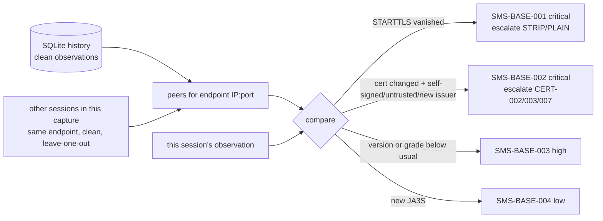

# 08 · Machine learning and per-endpoint baselining (stages 08–10)

Code: [`features.py`](../securemailscope/features.py), [`baseline.py`](../securemailscope/baseline.py),
[`ml.py`](../securemailscope/ml.py)

The ML has three jobs, in decreasing order of importance:

1. **Per-endpoint baseline**, the differentiator: is this session normal *for this server*?
2. **Risk model**: a smooth, explainable 0–100 risk per session.
3. **Isolation forest**: which sessions are statistical outliers at all?

## 1. The feature vector is the ML work

34 features per session. The encoding matters more than the model:

| Kind | Encoding | Features |
|---|---|---|
| nominal categories | one-hot | `proto_smtp/imap/pop3`, `port_relay/submission/access/nonstandard` |
| ordered categories | ordinal | `mode_ordinal` (plaintext 0, STARTTLS 1, implicit 2), `tls_version` (none 0 … TLS 1.3 5), `cipher_grade` (A 0 … F 3, **no TLS 4**) |
| booleans | 0/1 | forward secrecy, AEAD, cert expired/self-signed/mismatch/untrusted/weak-sig, stripping, injection, cleartext auth … |
| unbounded counts | `log1p`, clipped to [0, 1] | `cleartext_data` (message bytes outside TLS) |
| sizes | clip, then scale | `cert_key_weakness = max(0, 1 − bits/2048)` (EC: /256); 0 when no cert is visible |
| baseline context | 0/1 | `base_starttls_drop`, `base_cert_change`, `base_downgrade`, `base_new_ja3s` |

Two decisions worth defending:

- **"No TLS" is worse than any cipher** (`cipher_grade = 4`), so the ordering stays monotone.
- A **missing** certificate is neutral, not weak. TLS 1.3 hides it by design, and plaintext sessions
  are already penalised by other features. Penalising the absence twice would teach the model that
  TLS 1.3 is risky.

## 2. Cold start: the rules engine generates the labels

No public, labelled corpus of email cryptographic risk exists. We say so openly, because it's the
honest engineering answer:

1. `ml.synthesize()` creates thousands of plausible sessions as real `MailSession`, `TlsHandshake`
   and `ChainInfo` objects. There's a mix of healthy configurations (about 30%) and random
   combinations of every weakness, at realistic rates.
2. The **real rules engine** (`rules.evaluate`) and the real baseline escalation run on each one.
3. Each session is labelled with its **rule risk**, a noisy-OR of its findings:
   `100 × (1 − Π (1 − w_sev × (0.6 + 0.4 × exploitability)))`.
4. A gradient-boosted tree ensemble learns feature vector → risk.

**Why train a model on labels the rules already produce?** Because the model:

- gives a smooth score for combinations the rules never enumerated, instead of a step function;
- yields per-feature-group **explanations** (below);
- is the slot where **real analyst-labelled captures** go later. Retraining on them is the path from
  "distils the rules" to "learns what the rules miss". The `train` command and `MODEL_REV` exist
  for that.

Current metrics (`python -m securemailscope train`): **HistGradientBoostingRegressor, 4,000
synthetic sessions, 80/20 split, hold-out R² ≈ 0.99, MAE ≈ 1.8 risk points.** Healthy demo sessions
score about 1, and every critical session scores above 80.

### Why trees, not deep learning

| | Gradient-boosted trees | Deep learning |
|---|---|---|
| Data shape | tabular, mixed types: exactly what trees handle natively | needs embeddings and normalisation for everything |
| Data volume | works on thousands of rows | wants far more |
| Explainability | exact TreeSHAP, or cheap exact group Shapley | approximations only |
| Training cost | seconds on a laptop | GPU-hours |

We use scikit-learn's **HistGradientBoostingRegressor**, the same algorithm family as
LightGBM/XGBoost. It trains in seconds, and there's no extra dependency until you outgrow it.

## 3. Explanations: exact Shapley values over feature groups

"A score an analyst cannot justify is a score they will not act on."

Per-feature explanations mislead here. "No TLS" shows up in three correlated columns
(`mode_ordinal`, `tls_version`, `cipher_grade`), and knocking out one of them at a time creates
sessions that can't exist. So features are grouped the way an analyst thinks:

`channel encryption` · `key exchange strength` · `TLS negotiation anomalies` · `certificate` ·
`STARTTLS offer / stripping` · `command injection` · `cleartext credentials` ·
`cleartext message data` · `TCP anomalies` · `endpoint baseline deviation` · `service and port`

For each session, the groups that differ from an **ideal reference session** (implicit TLS 1.3,
AEAD, forward secret, clean) are the "players". With *G* such groups (typically 2–6), all 2^G
coalitions are enumerated, every session at once in one `predict` call. The **exact Shapley value**
of each group is then:

```
φ_g = Σ_{S ⊆ G∖{g}}  |S|! (|G|−|S|−1)! / |G|!  ×  [ f(S ∪ {g}) − f(S) ]
```

where `f(S)` is the model's prediction on the reference session with the groups in `S` taken from
the real session. The values sum exactly to `f(session) − f(ideal)`. If `shap` is installed,
TreeSHAP per feature is summed per group instead.

Examples from the demo capture:

| Session | Model risk | Explanation |
|---|---|---|
| STARTTLS command injection | 92.0 | command injection +92.0 |
| self-signed cert on the relay (MITM) | 97.6 | certificate +73.1, endpoint baseline deviation +26.0 |
| TLS 1.2 despite TLS 1.3 on both sides | 89.9 | endpoint baseline deviation +54.2, TLS negotiation anomalies +28.9 |
| DHE-1024 on SMTPS | 62.0 | key exchange strength +39.7, channel encryption +22.0 |

## 4. Per-endpoint baselining: the differentiator



An **observation** per session records: whether STARTTLS was offered, whether TLS was used, the
version, cipher and grade, JA3S, and the leaf certificate's fingerprint, issuer, self-signed and
trusted status.

**The example the design is built around:** the demo relay `mx.example.com:25` presents a
CA-issued certificate in 9 clean sessions. Then one session presents a self-signed certificate for
the same name. On its own, that is `SMS-CERT-002` at **medium** (self-signed certificates on port 25
are common). Against the profile, it's a certificate this endpoint has never used, self-signed,
replacing a stable CA-issued one. That's `SMS-BASE-002` **critical**, and the original finding is
escalated to critical with `escalated_from: "medium"`. `test_baseline_escalates_self_signed_to_critical`
pins this behaviour.

Safeguards:

| Risk | Mitigation |
|---|---|
| An attack poisons its own baseline | leave-one-out within the capture; only **clean** sessions (no critical/high findings, no deviations) are ever written to SQLite |
| An attacker controls the banner hostname | endpoints are keyed by server **IP:port** |
| Too little data | a deviation needs ≥3 clean peer observations; the report says when a profile came from this capture only |
| Legitimate change (cert renewal, server upgrade) | a *new but trusted cert from a known issuer* is not flagged; a new JA3S alone is only **low** |

`python -m securemailscope baseline --db baseline.sqlite` prints the learned profiles.

## 5. Isolation forest: unsupervised outliers

Isolation forest isolates points with random axis-aligned splits. Anomalies need fewer splits, so
they have shorter average path lengths. It's fit on the current capture's vectors plus up to 5,000
stored clean vectors from the baseline database.

**The contamination parameter matters a great deal on small captures.** It sets what fraction of
points the model *must* call anomalous. A fixed 10% on a 19-session capture forces about two
healthy sessions to be flagged just to fill the quota. We use `min(0.1, max(1/n, 0.01))` and skip
the forest entirely below 8 sessions (the baseline rules still run). `--contamination` overrides it.
Flagged sessions get `SMS-ML-001` (medium, confidence 0.5): **outliers are leads, not verdicts**.
The evidence lists the three most deviant features by z-score.

Alternatives considered: **One-Class SVM** is sensitive to scaling and kernel choice, and scales
poorly. **Autoencoders** need far more data and are hard to explain. **Local Outlier Factor** is
reasonable, but has no model to reuse across captures. Isolation forest is fast, needs no scaling,
and handles mixed binary and ordinal features acceptably.

## 6. Precision over recall

In security tooling, the cost of a false positive is **alert fatigue**, and that kills tools faster
than missed detections do. The design leans toward precision:

- Stripping requires positive evidence (a rewrite, a refusal or a vanished capability), not just
  "cleartext happened".
- "Server never offered TLS" (configuration) and "client ignored TLS" (client) are separate, lower
  severities from "stripped" (attack).
- The downgrade sentinel only fires when the client also offered TLS 1.3.
- ML outliers are medium, low-confidence leads.
- Unknowns (TLS 1.3 certificates, revocation) are reported as unknown, never as failures.
